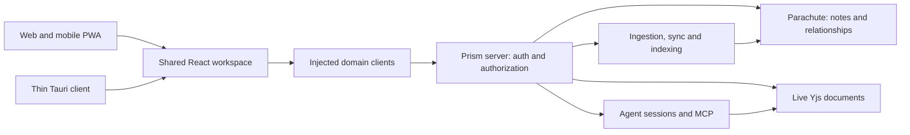

# Post-migration architecture audit

Audit date: 2026-10-01. Main source cutoff: `29d18b3a712072494f46105fcc514de88c7e0603`, plus the one-brace host verification fix at `55de6007b946398a47f9f805242ff8b3d9ef9ad3`. The checkout advanced during the review; this document incorporates the parity A/B/C source and that follow-up fix. Later migration commits require the R00 delta review.

This is a code and isolated-test audit, not a claim about authenticated production behavior. **Observed** below means present in inspected source or reproduced by a command. **Risk** describes a plausible consequence that needs a targeted test; it does not assert a production incident occurred. **Reported** means stated by migration documentation without this audit exercising the deployed feature.

## Overall assessment

The rebuild supplies a sound foundation for a coherent product. The main architectural opportunity is to connect and clarify existing domain capabilities, rather than replace the server/client separation. The largest remaining risks sit where implicit scope, identity, or write confirmation meets a polished UI. Those need explicit contracts alongside the redesign.

The server's SQLite databases hold operational records and rebuildable projections. They should not become a second canonical note/relationship store. Web cookies and native device tokens authenticate through the shared transport; vault and provider secrets stay on the server. The legacy `apps/desktop` remains a rollback host, while `apps/client` is the desktop product under test for this redesign.

## Existing foundations to preserve

| Foundation | Evidence and implications |
| --- | --- |
| Shared interface and injected services | `packages/core`; web bootstrap and `apps/web/src/transport.ts`. Continue using the injected clients instead of adding platform branches throughout components. The new native shell intentionally uses web services; the old `isDesktop` flag is not a reliable test for all native UI affordances. |
| Durable conversations | `apps/server/src/agent-sessions.ts`, session routes, `packages/core/src/lib/agent/useAgentConversation.ts`. Replay, sequence deduplication, cancellation, budget/profile handling, and transcript mirroring exist. |
| Real agent collaboration | `apps/server/src/mcp/tool-collab.ts`, collab operations and suggestions services. Agent suggestions use the live Y.Doc and human suggestion marks. Direct writes have a three-way merge path that preserves live human changes. |
| Navigation/resource protection | Tree projection, subscription invalidation, permission-filtered event stream, and relaxed polling exist. New list/search/context views must preserve these savings. |
| Server-side parity | Calendar edits/deletes, GitHub folder and Notion DB sync, skill configuration/cancellation, routing, and vault-wide wikilink job are present after parity A/B. Do not schedule them again as missing ports. |
| Native media/maps | Parity C provides hardened server proxies and native image rewriting. Test original URL persistence, authorization, cache behavior, and supported map/image forms rather than weakening native CSP. |
| Governance and publishing | Existing grants, policy precedence, proposals, audit/integrity handling, scoped publication APIs, theme validation, and wiki template provide substantial reusable behavior. |

`desktop-parity.md` reports zero command gaps and production live actions enabled. That does not demonstrate every UI, provider credential, permission, image type, or native flow is operational. The parity document also retains some superseded rows, and older repository guidance describes the former Rust-host architecture. Source plus a final handoff/runtime capability record takes precedence over those stale descriptions.

## Findings and remedies

### A01 — Unscoped offline writes and forced conflict overwrite

**Priority: P0 before redesigned write flows ship. Observed.** In [outbox.ts](../../../apps/web/src/offline/outbox.ts), queued records store method/path/body/time, without the original server/workspace/vault/actor identity. Replay uses the current connection and capability header without the original vault/workspace context headers. A PATCH conflict is retried without its precondition and with `force:true`; 404/410 removes the entry.

**Risk:** replay can target the wrong scope after a switch, overwrite another writer, or discard a recoverable local draft. This is not a claim that the ordinary read cache is unscoped: REST read cache keys and account-change clearing already contain useful isolation.

**Remedy:** R01's versioned scoped outbox, quarantined legacy entries, explicit conflict recovery, repeat-safe operation identity, and scoped composer/session drafts. Verify actual cross-scope behavior with fixtures before claiming an exploit or loss incident.

### A02 — Verification-script merge error found and resolved upstream

**Status: resolved at `55de600`; prevention remains in R00.** At `29d18b3`, `npm run verify:host -w @prism/web` failed with `Unexpected end of file` at line 403 of [verify-host-services.ts](../../../apps/web/scripts/verify-host-services.ts). The Notion DB test block opened near line 283 lacked its closing brace before the parity A block near line 301. The migration agent restored it; the audit rerun passed all 18 host checks. Normal application typechecking did not catch the missing brace because it does not include this script.

**Follow-up:** R00 includes verification scripts in a compile/parse gate. This audit made no application code change; the fix belongs to the migration agent's commit.

### A03 — Message serialization loses information needed by the UI

**Priority: high. Observed.** [MessageRenderer.tsx](../../../packages/core/src/components/renderers/MessageRenderer.tsx) parses timestamp/sender lines, uses positional identities, drops nonmatching continuation lines, and parses timestamps without an explicit offset. Matrix ingestion writes UTC-looking text without retaining a structured event envelope in that representation. [MessageThread.tsx](../../../packages/core/src/components/comms/MessageThread.tsx) groups by sender too broadly. [MessageComposer.tsx](../../../packages/core/src/components/comms/MessageComposer.tsx) accepts a void send callback and clears immediately.

**Remedy:** R04–R05 introduce additive event identities/timelines and a lossless legacy adapter, then repair display/scroll/drafts. The exact user-reported top-bar overlap still needs browser reproduction. Do not pretend a parser change alone proves that visual bug fixed. Existing archive rollover and person relations should be traversed, not replaced.

### A04 — Canonical people matching needs ambiguity and provenance

**Priority: high. Observed.** [worker/people.ts](../../../apps/server/src/worker/people.ts) indexes email, Matrix identity, normalized name, and path; duplicate keys keep a first match, and name fallback can conflate distinct people. Matrix ingestion already creates `messages-with` links and filters self/bridge identities. Proton linking is optional (`PROTON_LINK_PEOPLE`), applies to newly created notes, and does not create missing people in that path.

**Risk:** a polished person timeline could confidently aggregate the wrong person's private context or omit historic email. Runtime flag state was not read from production.

**Remedy:** R04 explicit external-identity namespaces, verified matches, ambiguity review, aliases/manual overrides, and previewable historical repair. Telegram here is primarily represented through the Matrix bridge; no new direct Telegram ingestion service is assumed.

### A05 — Chat transport is durable; document context and modes need refinement

**Priority: high. Observed.** [AgentChat.tsx](../../../packages/core/src/components/agent/AgentChat.tsx) already has useful sticky-bottom behavior, but stores a global selected-session key and local composer state. The side panel can keep a session bound to another note. Server session startup attaches saved note text with limits; structured unsaved selection/context is not yet the turn contract. Active turns reject concurrent sends rather than providing a durable editable follow-up queue.

[agent-profiles.ts](../../../apps/server/src/agent-profiles.ts) includes raw vault and guarded Prism profiles. Prism profiles are feature-gated; `prism-rw` still includes direct update/restore and is not suggest-only. Current hosted session access is owner-only. Scoped member MCP does not mean member-hosted chat exists. The legacy fallback path must not be invoked merely because the web agent is unavailable.

**Remedy:** R06–R07 preserve session/event machinery and add scoped context/drafts plus persistent per-session Read-only, Suggested edits only, and Read/write policies. The user's requested permission toggle must be enforced beyond the UI, including safe active-turn changes. Retain honest availability and keep any expansion of hosted actor permissions separately gated.

### A06 — Suggestion identity and anchored review need additive improvements

**Priority: high. Observed.** [suggestionMarks.ts](../../../packages/core/src/editor/suggestionMarks.ts) has author/color attributes but lacks stable per-suggestion/turn identity. Text replacement in the server suggestion path needs ambiguity-aware anchoring instead of assuming a repeated text match is unique. The current live Yjs path is valuable and must remain canonical.

Comment-only capabilities cannot author anchored Yjs comments under current enforcement; this is a deliberate limitation, not permission to let a view-only client submit arbitrary document changes. Governed content proposals are distinct from tracked insertions/deletions.

**Remedy:** R07 stable additive mark attributes, robust anchors, idempotent review, and explicit governed transitions. R12 keeps UI promises aligned with server grants.

### A07 — Transcript matching is first-qualifying and partially repairable

**Priority: high. Observed.** [worker/calendar.ts](../../../apps/server/src/worker/calendar.ts) searches a nearby date window, adds title/participant signals, and chooses the first candidate above a low threshold rather than ranking with a margin. Meeting and transcript updates are sequential. An interruption can leave one side linked; existing-link early exits may then skip repair. Provider ingestion often retains date/name evidence less precise than actual occurrence identity.

**Remedy:** R08 richer source evidence where supplied, ranked matches, ambiguity/manual review, recurring occurrence identity, multi-recording relations, and idempotent repair. Preserve Fireflies source-deletion safeguards and calendar action scope/notification protections.

### A08 — Semantic indexing is intentionally primary-vault only

**Priority: high for expanded search. Observed.** [rag/store.ts](../../../apps/server/src/rag/store.ts) keys embedding rows by note/chunk without vault identity. [routes/rag.ts](../../../apps/server/src/routes/rag.ts) correctly rejects non-primary semantic requests; this guard should remain until the index is scoped. Hybrid retrieval and permission filtering already exist. The client can silently fall back to keyword search.

**Remedy:** R09 scoped versioned indexes, shared authorized retrieval, visible fallback and bounded indexing. This is an extension of a guarded feature, not evidence that current cross-vault search is already leaking. Benchmark before changing vector infrastructure.

### A09 — Canvas links can appear synchronized after failure

**Priority: high. Observed.** [CollabCanvas.tsx](../../../packages/core/src/components/renderers/CollabCanvas.tsx) catches link mutation failures while advancing its in-memory tracking. Process-local maps do not establish durable ownership of a relationship shared by multiple canvases. [CanvasRenderer.tsx](../../../packages/core/src/components/renderers/CanvasRenderer.tsx) and note-card helpers already distinguish derived overlays from authored arrows.

**Risk:** reload/concurrent edits can diverge from metadata; one arrow deletion may erase a relationship with another source of intent.

**Remedy:** R10 per-arrow assertions, visible pending/error states, multi-source ownership, and reconciliation. Preserve decorative arrows and nonpersisted overlays. The gateway's non-owner graph/link limitations need explicit scoped services, not client workarounds.

### A10 — Graph and boards have useful engines but narrow interaction models

**Priority: medium. Observed.** GraphPanel/GraphFullscreen cap locally displayed nodes after fetching the graph and offer primarily 3D navigation. [TaskBoardRenderer.tsx](../../../packages/core/src/components/renderers/TaskBoardRenderer.tsx) uses fixed statuses, ignores its context note for configuration, lacks persisted manual ranking, and relies on pointer dragging. Existing BoardWidget/dashboard filtering supports richer configuration but is not the same editable board.

**Remedy:** R10 bounded authorized graph neighborhoods and a readable 2D/list option; R11 shared view configuration using existing dashboard primitives. Keep tasks canonical notes and preserve optional 3D.

### A11 — Wikilink resolution differs across paths

**Priority: medium. Observed.** The new [wikilinks-job.ts](../../../apps/server/src/wikilinks-job.ts) supports dry-run/progress/cancel and marks duplicate names ambiguous. The shared per-note vaultOps resolver can choose an early filename before a later exact path match. Inline raw wikilink decoration also needs caret, clipboard, and accessibility checks.

**Remedy:** R09 one resolution policy and ownership-aware derived references; retain existing guarded batch job and optimistic write preconditions.

### A12 — Publishing, governance, and integrations need composition, not replacement

**Priority: medium. Observed.** PublishPanel is a large component; the publication registry currently supplies a wiki layout with validated theme choices and scoped graph/map/backlinks. Governance already has plain-language policy components, scope precedence, audit and proposal services. Sync now has stored configurations, visibility constraints, idempotent/conflict-aware paths, rate limits, and audit information.

**Remedy:** R12–R14 decompose around existing services, improve effective-access explanations, add presentation revisions/templates, and expose integration health/history. Preserve server-owned credentials and all boundary checks. Do not rebuild old desktop-only services in the browser.

## Verification evidence and limits

The final isolated suite and typecheck results are recorded in [RELEASE-GATES.md](RELEASE-GATES.md). During the audit, local socket creation failed inside the sandbox; rerunning the fixture suites with localhost access resolved that environment limitation. The separate host-services script failure was reproduced, fixed upstream, and verified passing.

No authenticated production browser session, real mobile PWA session, installed `apps/client` interaction, live provider send, sync export, or governance/publication mutation was executed in this audit. No production build directory was overwritten. Existing Playwright configuration defaults toward a live server and loads server environment values through its helpers, so its mutation tests were intentionally not run without an isolated fixture setup.

The roadmap must not equate passing isolated tests with full feature parity. R00 establishes the actual final baseline; R15–R16 produce the runtime evidence the user requested.
