# Prism screen mockups

> **Historical design reference (2026-09-30, pre-migration `c191b52`).** The [post-migration plan](POST-MIGRATION-PLAN.md), [current contracts](DOMAIN-CONTRACTS.md), and [release gates](RELEASE-GATES.md) supersede runtime assumptions, sequencing, and authority statements below. Retain applicable interaction details. Each agent session now supports **Read-only, Suggested edits only, and Read/write**; earlier Ask/Suggest examples are not a restriction. Concept logos are placeholders pending [BRAND.md](BRAND.md).

These are proposed designs for the [workspace experience upgrade](README.md), generated with the built-in imagegen tool on 2026-09-30. They use fictional content. They are not screenshots of implemented Prism.

**Browse the [visual gallery](mockups.html)** for an overview, or use the screen index below. Open an image for its full resolution. The existing three overview concepts are retained; the new sixteen boards expand the screen and state coverage.

The [design specification](DESIGN.md), [message requirements](MESSAGES.md), and [backend contracts](CONTRACTS.md) govern behavior. Generated labels, spacing, icons, and sample counts are illustrative; raster mockups cannot establish working accessibility, responsive layout, or data correctness. Implementation still begins with F00 after the architecture v2 handoff.

## Current implementation concepts (2026-10-01)

- [17 · Brand direction](assets/17-prism-brand.png): many spectrum inputs, one unified output. The production vector master governs final geometry.
- [18 · Session permissions](assets/18-session-permissions.png): document collaboration on desktop/mobile with Read-only, Suggested edits only, and Read/write.

These are generated concepts, not evidence of implemented permissions. Exact prompts are in [implementation-prompts.json](implementation-prompts.json).

## Screen index

| Board | Screen / state | Work packages |
| --- | --- | --- |
| 01 | [Writing workspace](assets/01-workspace-writing.png) | F01, F02, F03 |
| 02 | [Agent conversations](assets/02-agent-sessions.png) | F02, F04 |
| 03 | [Choosing context](assets/03-context-picker.png) | F04, F09 |
| 04 | [Inspecting a source](assets/04-source-preview.png) | F03, F04, F09 |
| 05 | [Working with an active agent](assets/05-agent-live-states.png) | F04, F10 |
| 06 | [Reviewing proposed changes](assets/06-proposal-review-states.png) | F05 |
| 07 | [Messages on desktop](assets/07-messages-desktop.png) | F06, F07, F08 |
| 08 | [Messages on mobile](assets/08-messages-mobile.png) | F02, F07, F08, F10 |
| 09 | [History and participant identity](assets/09-message-history-identity.png) | F06, F07 |
| 10 | [Email and agent-assisted replies](assets/10-email-agent-draft.png) | F07, F08 |
| 11 | [Search and command palette](assets/11-search-command-palette.png) | F02, F09 |
| 12 | [Properties and related context](assets/12-properties-related-context.png) | F03, F09 |
| 13 | [Document history](assets/13-document-history.png) | F03, F05, F09 |
| 14 | [Mobile navigation and creation](assets/14-mobile-navigation-create.png) | F01, F02, F03 |
| 15 | [Workspace preferences](assets/15-preferences-workspace.png) | F01, F02, F10 |
| 16 | [Empty, offline, and recovery states](assets/16-empty-offline-error-states.png) | F01, F04, F07, F08, F10 |

## Existing overview concepts

### Desktop document collaboration

Original overview: writing beside a document-bound conversation.

[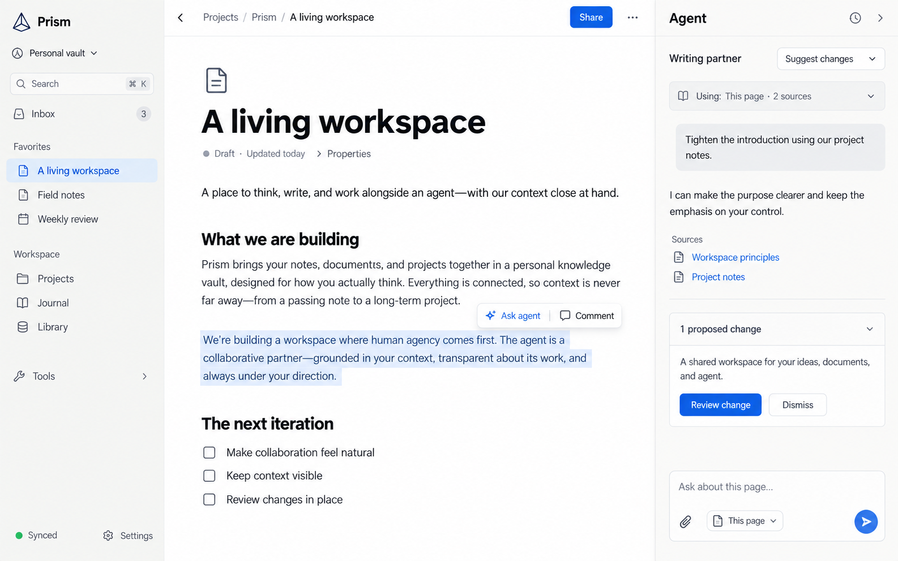](assets/desktop-collaboration.png)

### Desktop change review

Original dark-mode overview: reviewing an agent's proposed document changes.

[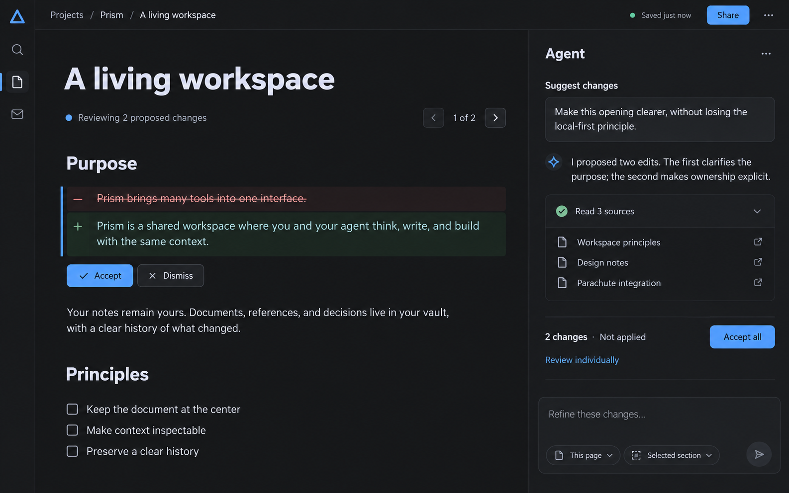](assets/desktop-review.png)

### Mobile write, ask, and review

Original three-state overview of document collaboration on mobile.

[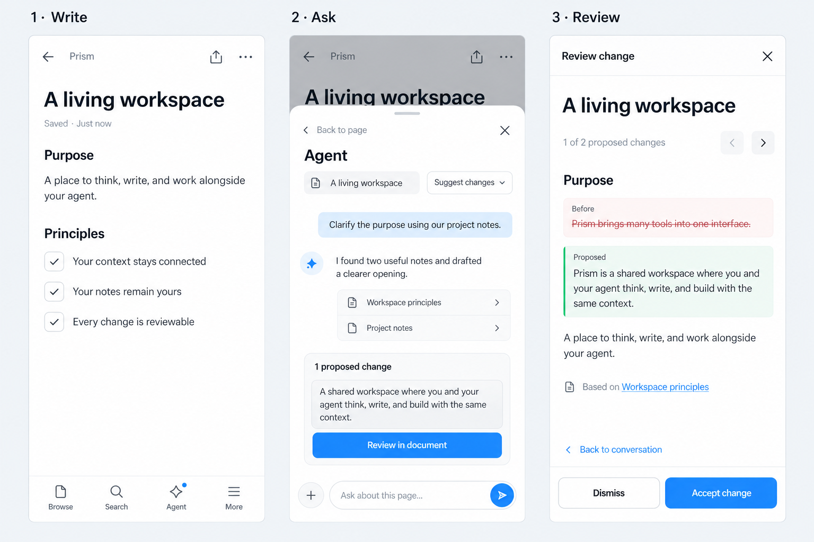](assets/mobile-workflow.png)

## Detailed screens

### 01 · Writing workspace

Quiet document chrome, tabs, outline, slash actions, and visible access to the agent.

[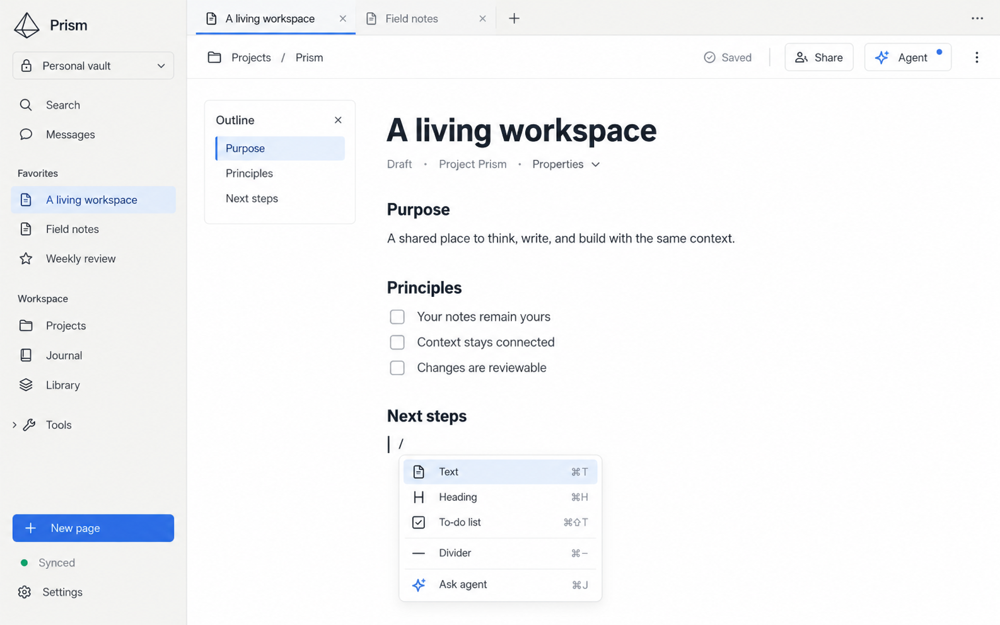](assets/01-workspace-writing.png)

**Behavior to preserve:** The document is the main surface. Page controls stay compact; formatting appears at the selection or slash menu. Tabs, outline, and the agent are available without forcing every panel open.

**Implementation:** F01, F02, F03 in [WORKPLAN.md](WORKPLAN.md).

### 02 · Agent conversations

Document-bound session history and a full conversation view with sources and a working-document link.

[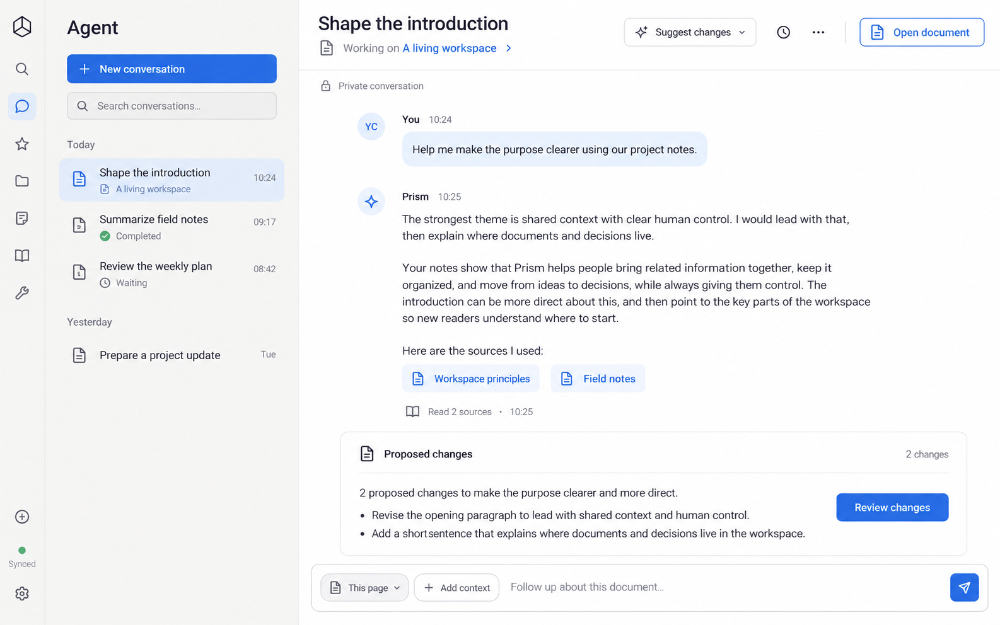](assets/02-agent-sessions.png)

**Behavior to preserve:** Full conversation mode and the document side panel share the same durable session. The working-document link stays explicit. Opening history or a source must not silently change the target of a running task.

**Implementation:** F02, F04 in [WORKPLAN.md](WORKPLAN.md).

### 03 · Choosing context

Desktop source picker and mobile attachment sheet distinguish explicit context from searchable vault scope.

[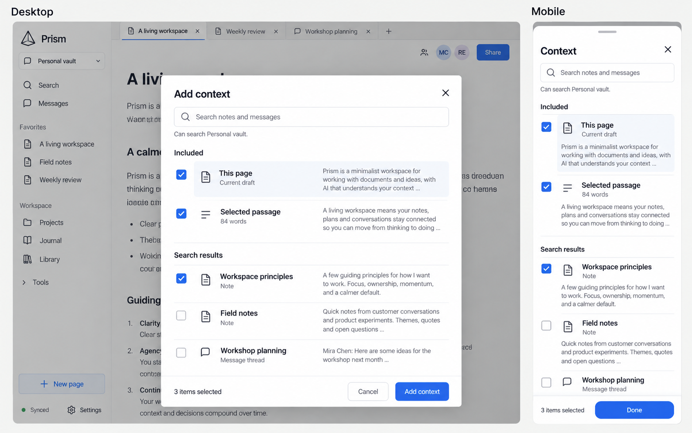](assets/03-context-picker.png)

**Behavior to preserve:** Selected references, the current unsaved draft, and the vault the agent may search are different concepts. Counts describe selected inputs; only completed retrieval can claim a source was actually used.

**Implementation:** F04, F09 in [WORKPLAN.md](WORKPLAN.md).

### 04 · Inspecting a source

A source peek preserves the active document conversation and shows the relevant cited passage.

[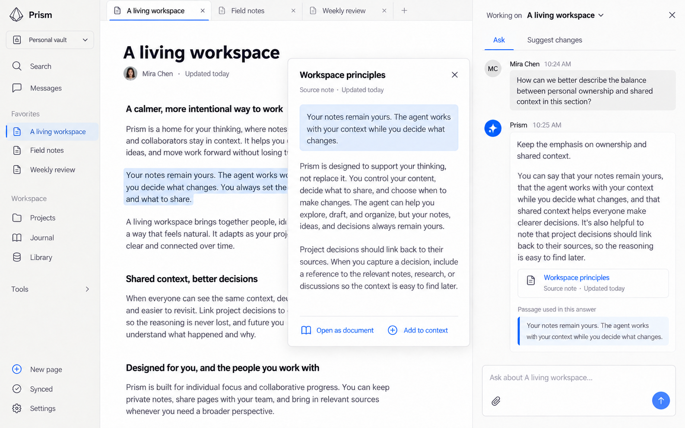](assets/04-source-preview.png)

**Behavior to preserve:** A source preview is temporary reading context. Returning to the document restores the editor position and the same conversation. Permission changes produce a clear unavailable state.

**Implementation:** F03, F04, F09 in [WORKPLAN.md](WORKPLAN.md).

### 05 · Working with an active agent

Running, follow-up drafting, queueing, stopping, and reconnecting states.

[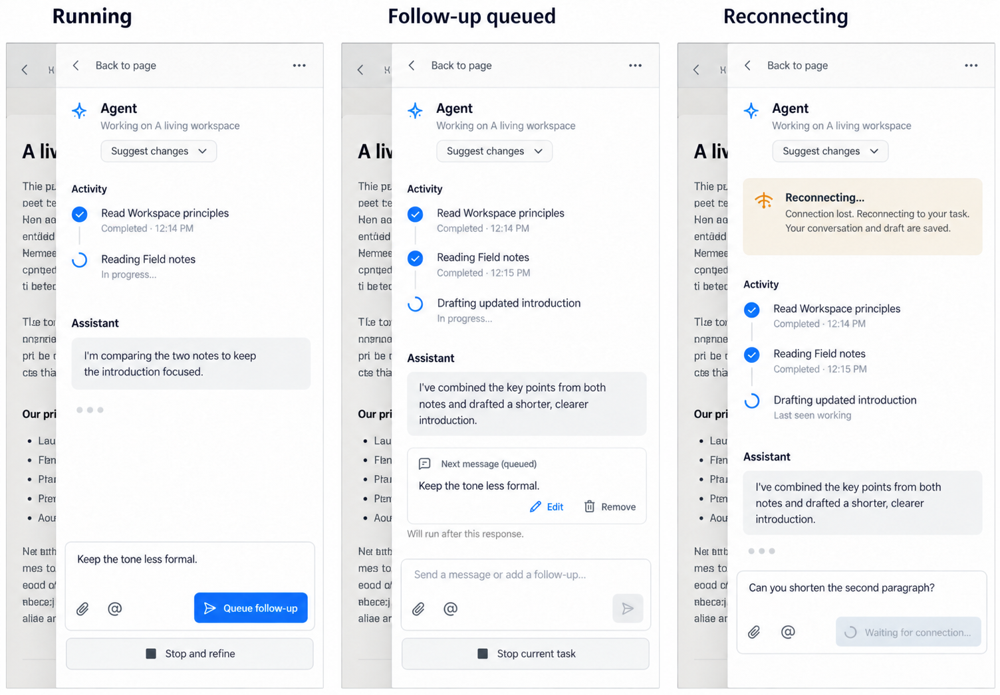](assets/05-agent-live-states.png)

**Behavior to preserve:** The user can continue composing while a task runs. Queued follow-ups have visible status and remain editable/cancellable according to the final backend contract. Reconnecting must recover the existing task rather than create another one.

**Implementation:** F04, F10 in [WORKPLAN.md](WORKPLAN.md).

### 06 · Reviewing proposed changes

Pending, accepted, and conflicted edits, with a separate governed-review treatment.

[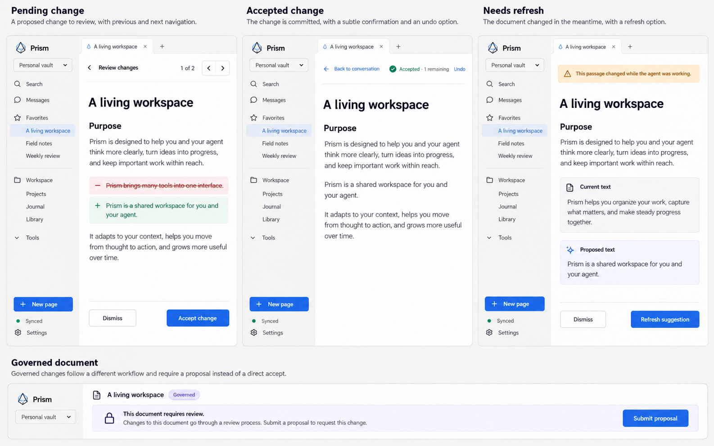](assets/06-proposal-review-states.png)

**Behavior to preserve:** Pending edits have readable diffs and explicit actions. Accepted edits become document history. A stale edit needs refreshed comparison; governance-controlled documents use their proposal workflow. No approval action can silently overwrite newer work.

**Implementation:** F05 in [WORKPLAN.md](WORKPLAN.md).

### 07 · Messages on desktop

Master/detail conversations with clear senders, restrained tagging, multiline text, and a reliable composer.

[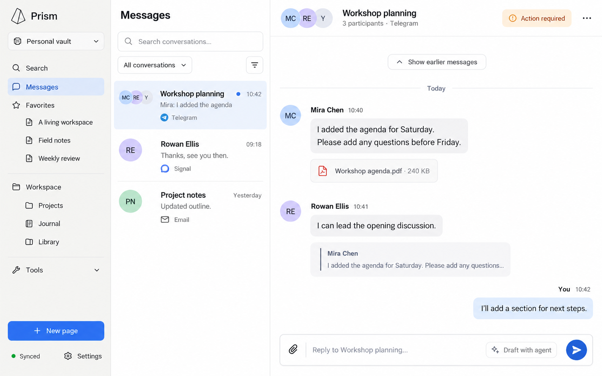](assets/07-messages-desktop.png)

**Behavior to preserve:** Each sender has a readable name and stable identity. Outgoing messages are visibly yours. One compact header owns the thread; tags and filters do not become stacked sticky bars. Multiline content, attachments, reply references, and dates remain readable.

**Implementation:** F06, F07, F08 in [WORKPLAN.md](WORKPLAN.md).

### 08 · Messages on mobile

Conversation list, full-width thread, and keyboard-safe reply composition.

[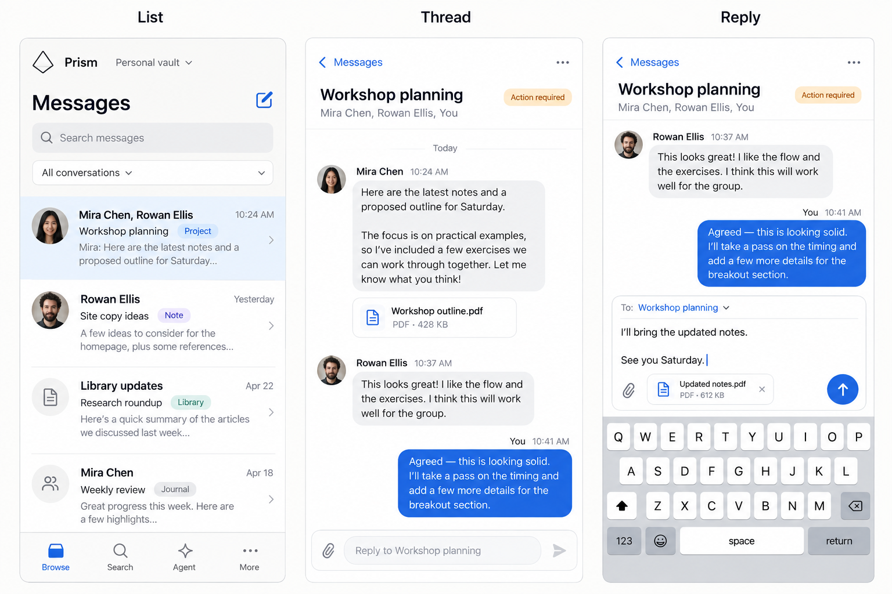](assets/08-messages-mobile.png)

**Behavior to preserve:** Mobile gives the list, thread, and composer their own usable width. The keyboard owns the lower viewport during composition; global navigation must not overlap the reply box. Back returns to the previous list position.

**Implementation:** F02, F07, F08, F10 in [WORKPLAN.md](WORKPLAN.md).

### 09 · History and participant identity

Dark-mode archive reading, explicit dates, participant identity, and new-message handling.

[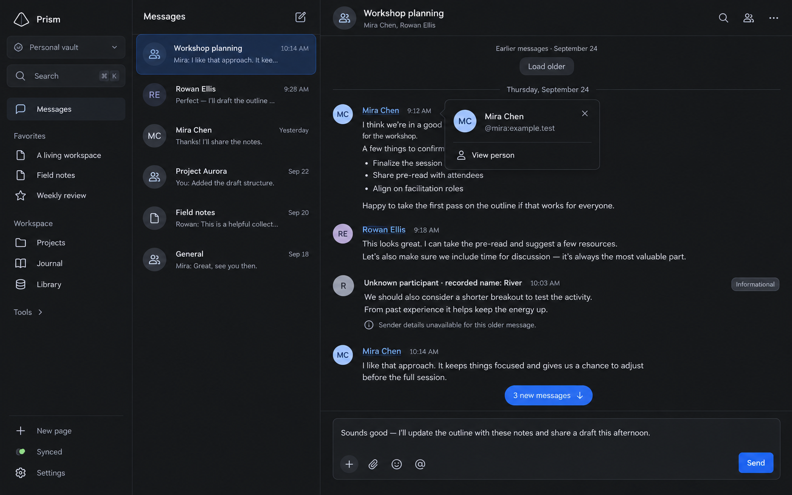](assets/09-message-history-identity.png)

**Behavior to preserve:** Reading older pages preserves the viewport. New messages accumulate behind an explicit jump action. A sender's source identity is inspectable; an unresolved person is never assigned a guessed name or contact.

**Implementation:** F06, F07 in [WORKPLAN.md](WORKPLAN.md).

### 10 · Email and agent-assisted replies

Readable email history, explicit account and recipients, and agent suggestions that enter a draft.

[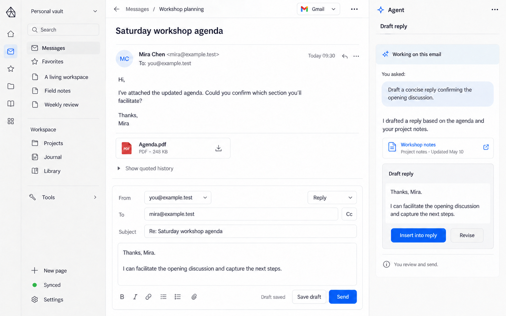](assets/10-email-agent-draft.png)

**Behavior to preserve:** An agent suggestion enters an unsent human draft. Account, recipients, and thread remain visible before Send. The interface must preserve readable email content and expose quoted history without hiding the only available body.

**Implementation:** F07, F08 in [WORKPLAN.md](WORKPLAN.md).

### 11 · Search and command palette

Unified search with useful passages, resource types, keyboard navigation, and separate context actions.

[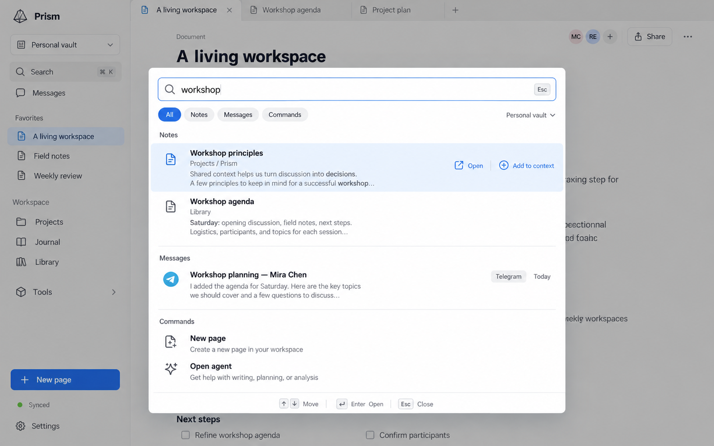](assets/11-search-command-palette.png)

**Behavior to preserve:** Search is an entry point into existing notes and conversations. Opening a result and attaching it as agent context are separate actions. Command items have distinct icons and keyboard behavior.

**Implementation:** F02, F09 in [WORKPLAN.md](WORKPLAN.md).

### 12 · Properties and related context

Compact page properties, tag editing, backlinks, and related notes without losing the agent session.

[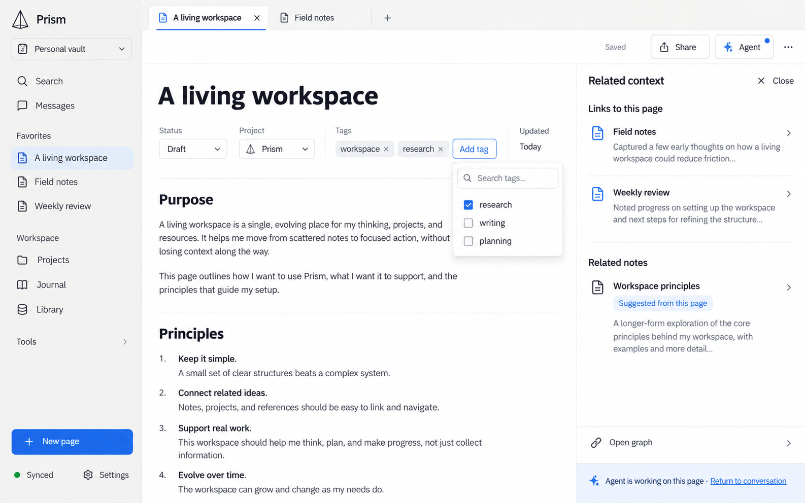](assets/12-properties-related-context.png)

**Behavior to preserve:** Properties belong to the page; tags use a predictable picker. Related notes and backlinks open as contextual views. The active agent session remains accessible when an inspector temporarily occupies its space.

**Implementation:** F03, F09 in [WORKPLAN.md](WORKPLAN.md).

### 13 · Document history

Version list, read-only comparison, attribution, and a deliberate restore action.

[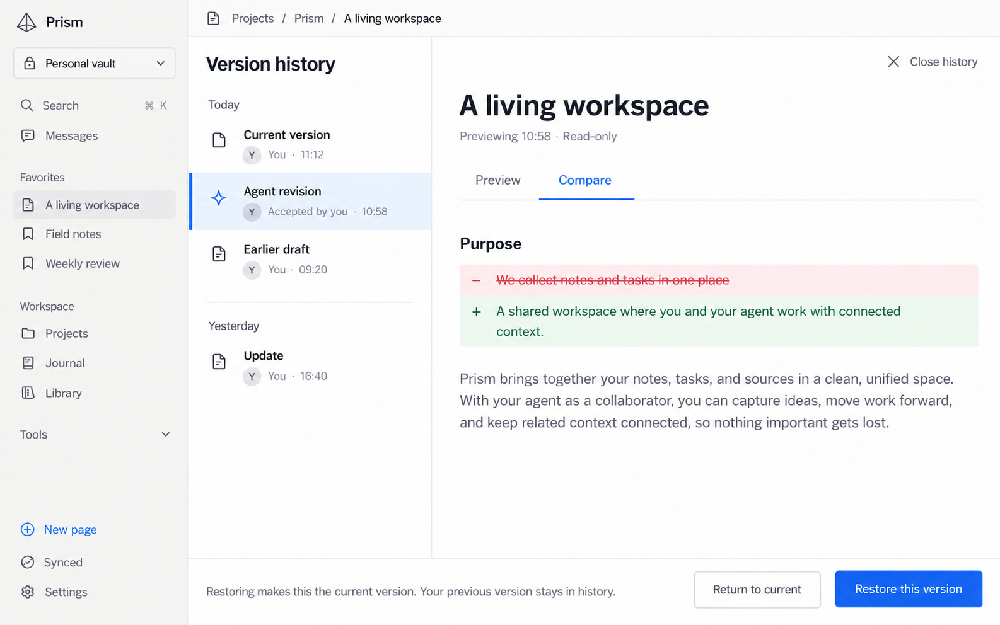](assets/13-document-history.png)

**Behavior to preserve:** Restoring a whole version is distinct from accepting a proposed edit and undoing a local change. Show attribution, the version being compared, and the consequence of restore before committing it.

**Implementation:** F03, F05, F09 in [WORKPLAN.md](WORKPLAN.md).

### 14 · Mobile navigation and creation

Vault switching, Browse, open documents, new-page creation, and preserved specialist tool access.

[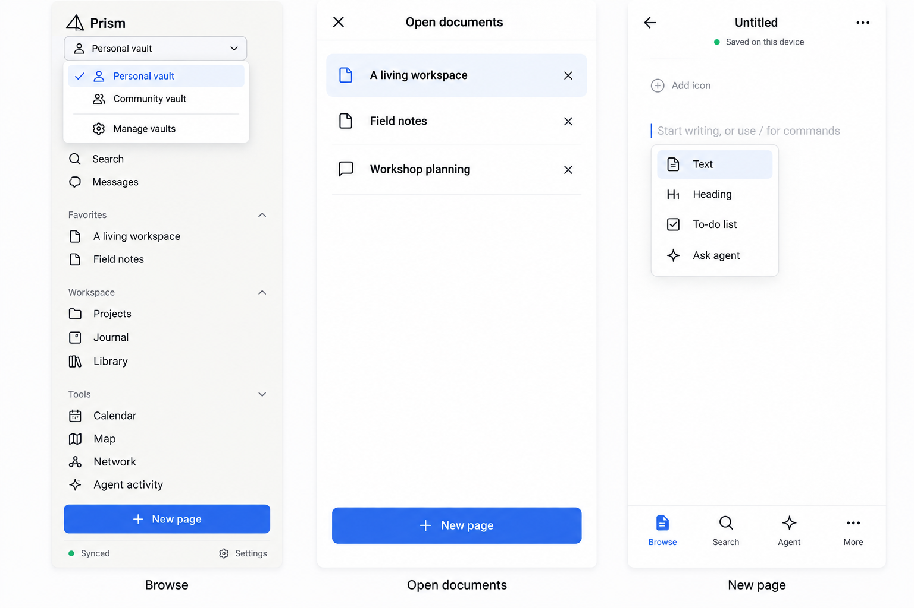](assets/14-mobile-navigation-create.png)

**Behavior to preserve:** Browse keeps vault switching, creation, open documents, and the folder tree within reach. More/Tools preserves specialist features. These placements remain a starting design to validate against actual mobile usage at F00.

**Implementation:** F01, F02, F03 in [WORKPLAN.md](WORKPLAN.md).

### 15 · Workspace preferences

Readable theme, typography, layout preferences, and accessible sync/account entry points.

[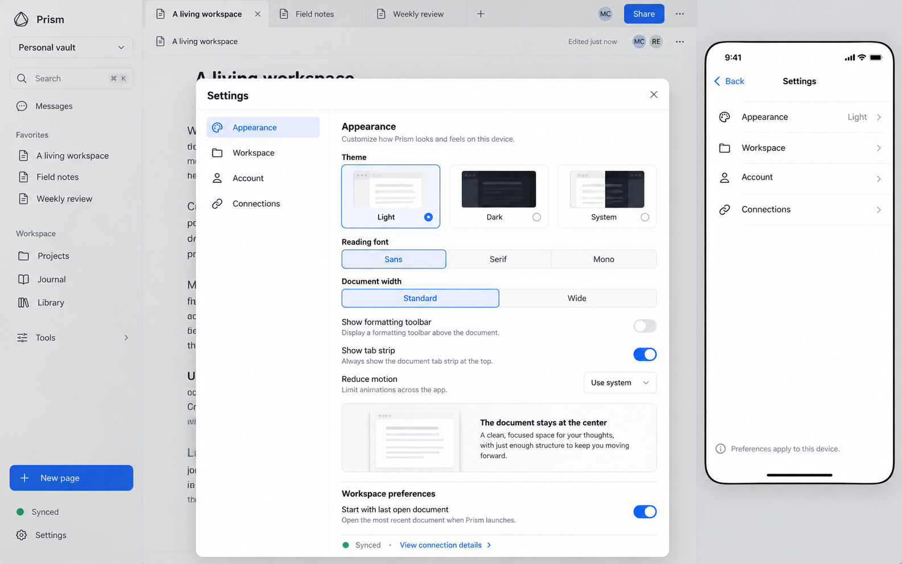](assets/15-preferences-workspace.png)

**Behavior to preserve:** Presentation choices use shared tokens and components. Preferences should explain their effect in familiar language. The final implementation must establish which choices are device-local or synchronized.

**Implementation:** F01, F02, F10 in [WORKPLAN.md](WORKPLAN.md).

### 16 · Empty, offline, and recovery states

Honest empty, access, offline, source, send-failure, and interrupted-task treatments.

[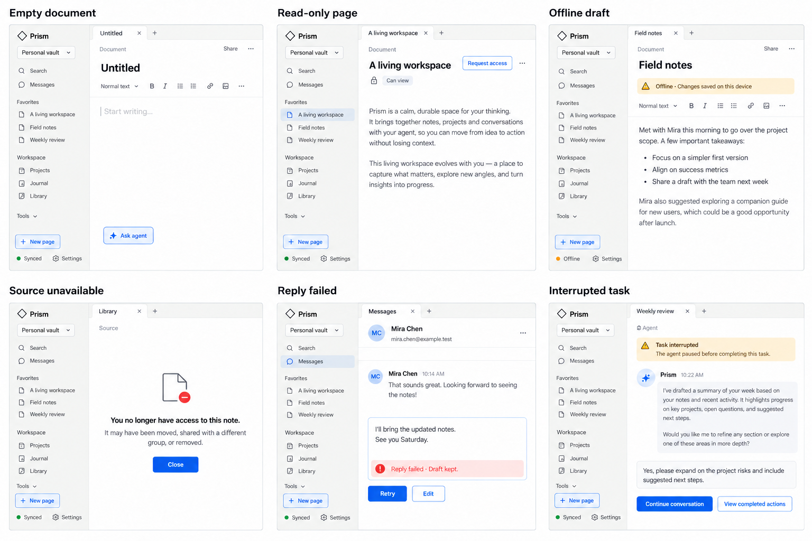](assets/16-empty-offline-error-states.png)

**Behavior to preserve:** Each failure explains what happened, what was preserved, and the next available action. Drafts survive offline and failed sends. An interrupted agent task is not shown as successfully completed. Retry delivery must follow the server's confirmation/idempotency contract.

**Implementation:** F01, F04, F07, F08, F10 in [WORKPLAN.md](WORKPLAN.md).

## Coverage and boundaries

| Planned area | Visual references |
| --- | --- |
| F00 backend handoff and baseline | No separate product screen; it gates every design |
| F01 visual primitives and accessibility | 01, 03, 07, 08, 14–16; shared throughout |
| F02 navigation and routes | 01, 02, 08, 11, 14, 15 |
| F03 documents and editor integration | Original desktop/mobile overviews; 01, 04, 12–14 |
| F04 conversations and context | Original collaboration overview; 02–05, 10, 16 |
| F05 proposed changes | Original review overview; 06, 13 |
| F06 message read model | 07–09 show the visible outcome; data normalization is not a separate screen |
| F07 message presentation | 07–10, 16 |
| F08 drafts and sending | 07, 08, 10, 16 |
| F09 search and connected details | 03, 04, 11–13 |
| F10 continuity, mobile, performance | Original mobile overview; 05, 08, 14–16 |
| F11 regression and release | No separate product screen; validates all flows |

This set covers the proposed redesigned surfaces and representative normal, loading, review, and recovery states. It does not propose new designs for every existing specialist renderer. Canvas, spreadsheet, code, presentations, maps, calendars, governance, publishing, and other preserved tools remain in scope for navigation and regression checks; they are not being independently redesigned by this plan. Native clients inherit the shared interface.

The source prompts for all sixteen new boards are recorded verbatim in [mockup-prompts.json](mockup-prompts.json). No application code or architecture-v2 files were changed to create this set.

## Expanded references · October 2

### 19 · Canvas and graph (D03 / R10)

[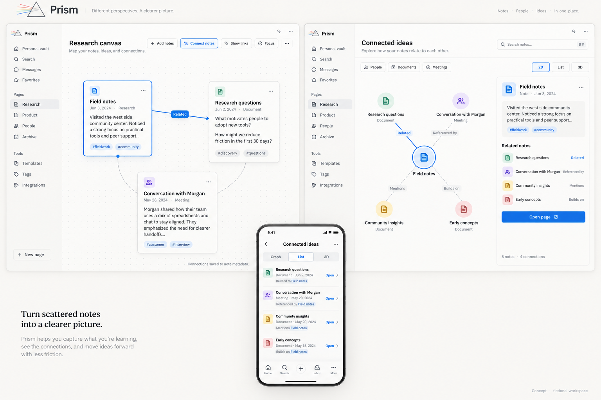](assets/19-canvas-graph.png)

Fictional concept, not implementation evidence. Extends the neutral writing system to existing note cards, authored connections, graph inspection and a phone list alternative. Preserve the real canvas toolbar/Excalidraw controls. Only authored note relationships are written to metadata; reference links stay decorative. Generated relation names and snippets are illustrative: only display types/body data actually returned by the current access-filtered clients. The approved vector logo remains authoritative; this raster's logo, extra navigation labels and slogans do not add product requirements.

### 20 · Task boards (D04 / R11)

[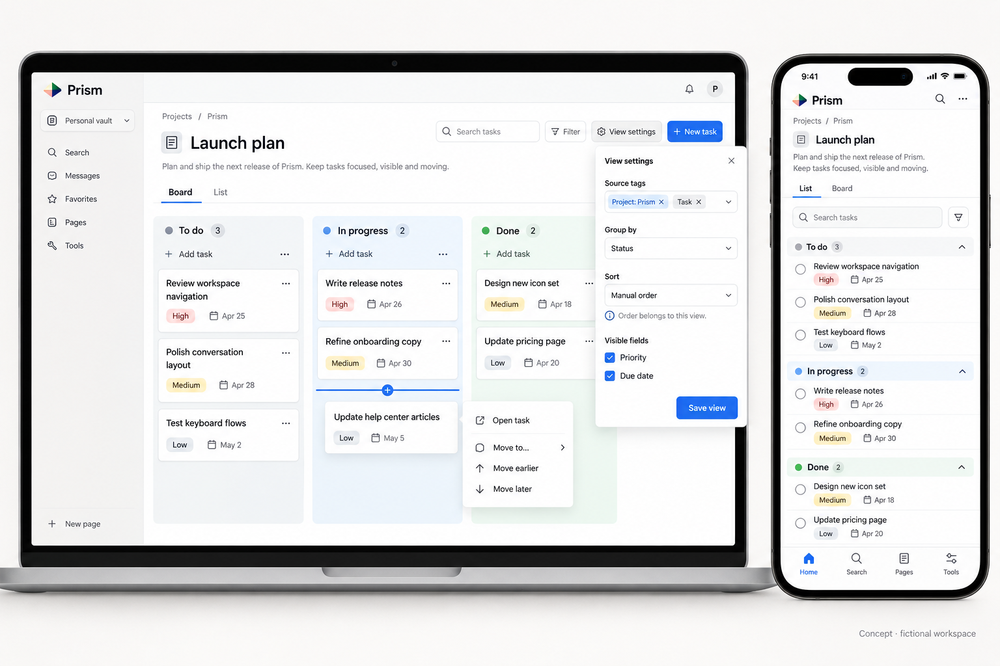](assets/20-task-boards.png)

Fictional concept for view configuration, readable cards, manual ordering with keyboard alternatives and phone list mode. The same underlying tasks retain their data across views; ordering belongs to the configured view. Current client/server capabilities govern edits and conflicts. The generated logo, device furniture, bottom navigation and sample dates are illustrative; preserve the shared Prism vector and actual shell. [Generation prompt](expanded-mockup-prompts.json).

### 21 · People and related records (C06 / R04)

[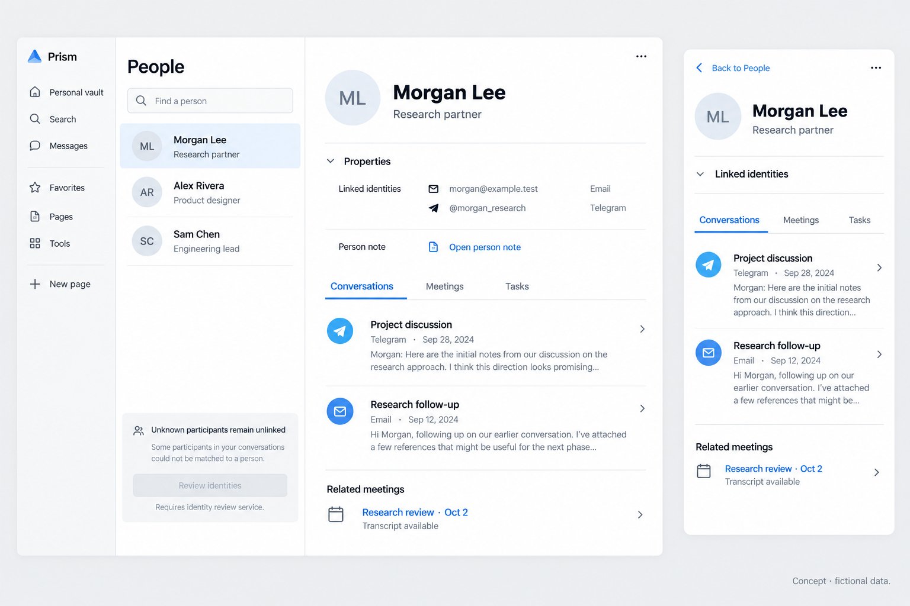](assets/21-people-profile.png)

Browse canonical people, explicit linked identities, conversations, meetings and tasks using existing related-record APIs. Generated snippets/platform decorations require real source data and are omitted when absent. Unknown participants remain unlinked; the illustration's review queue is unavailable until the backend contract exists. Do not infer identity from display names or add fake verified badges. Mobile uses one profile surface with a clear return to the directory.

### 22 · Calendar and transcript review (D02 / R08)

[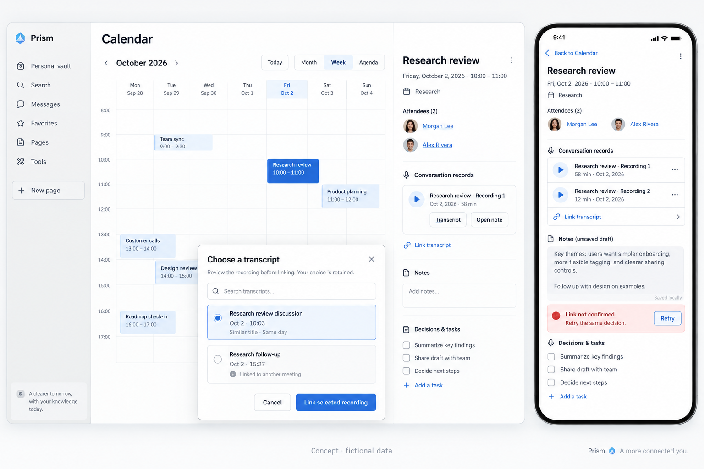](assets/22-calendar-transcripts.png)

An event connects its canonical people and conversation records. Review candidates before linking; preserve the same pending decision during uncertain outcomes. Linked-elsewhere records reveal no other meeting identity. Backend contracts govern evidence, visibility, date-only starts and retry semantics. Generated playback, inline notes, task checkboxes and participant photographs are illustrative: only surface real supported capabilities and records, never synthesize them from this board. The selected event and single-surface phone detail are the interaction reference.

### 23 · Sharing and governance (D05 / R12)

[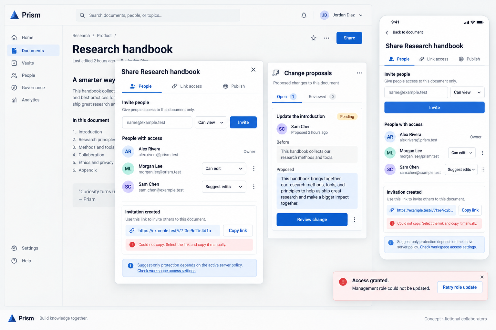](assets/23-sharing-governance.png)

Document, active-vault and publishing scopes remain distinct. Show actual access and proposal attribution, retain invitation links when clipboard access fails, and state partial success truthfully. Do not infer server enforcement from the raster's role labels: human suggest-only remains gated on the coordinated backend/client release. The generated shell, navigation additions, slogans and sample proposal content are not new requirements; use the existing Prism shell and vector brand.

### 24 · Publishing studio (D06 / R13)

[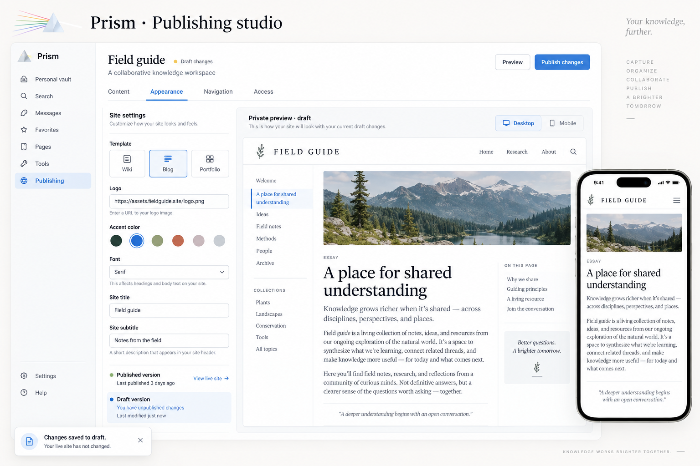](assets/24-publishing-studio.png)

A quiet settings column beside an explicitly requested private preview, with draft and live revisions kept distinct. Use actual supported templates (Wiki, Docs, Landing); the generated Blog/Portfolio names, navigation links, stock imagery and slogans are illustrative, not new capabilities. Preserve publication-specific branding, scope/access, saved draft, restore and explicit publish. Navigation is separately gated on its reviewed contract. Existing vector logo remains authoritative.

### 25 · Connections and settings (D07 / R14)

[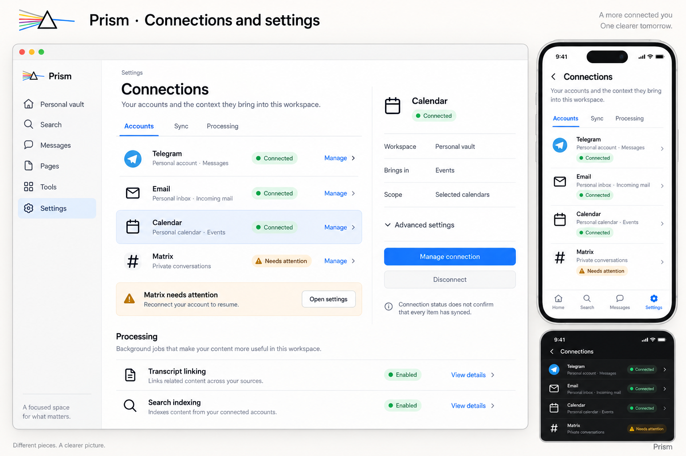](assets/25-connections-settings.png)

Organize existing accounts, synchronization controls and processing settings around what the user is connecting. A connected account is not proof every item has synced. Only actual returned health, scope and actions may appear; the fixture rows and statuses are illustrative. Do not invent reconnect, disconnect, calendar selection, conflict repair or processing metrics where the current host lacks them. Preserve exact authority and distinguish owner settings from personal preferences.

Both boards were generated with built-in imagegen; exact prompts are recorded in [expanded-mockup-prompts.json](expanded-mockup-prompts.json). They are visual references, not implementation evidence.
